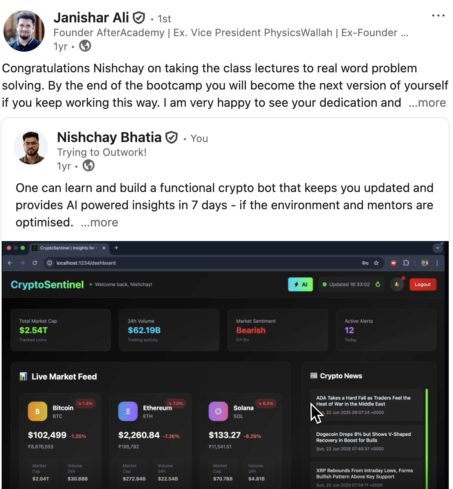

# CryptoSentinel — Real-Time Crypto Intelligence with a Local-LLM Analyst

A market-monitoring system that fuses **live prices**, **breaking news**, and an
**on-device LLM** into structured trade signals. Three independent worker-thread
bots poll CoinGecko and CoinDesk on their own clocks; a fourth runs a **local
Ollama model** that reads a specific coin against a specific headline and returns
a strict-JSON verdict — sentiment, confidence, a BUY/SELL/HOLD signal, and the
reasoning. No cloud AI keys, no paid data feeds: the whole pipeline runs on your
machine.

> Built during **Janishar Ali's** (AfterAcademy founder, ex-VP PhysicsWallah)
> bootcamp, on his open-source [`node-bot-app`](https://github.com/fifocode/node-bot-app)
> worker-runner harness. The bot scheduler and logging are that scaffold; the
> crypto + news + **local-LLM intelligence layer, the analysis prompt design, the
> Express API, and the full React frontend are mine.**

## Demo

<video src="https://github.com/NishB369/CryptoSentinel/raw/main/docs/demo.mp4" controls width="100%"></video>

*90-second walkthrough — live price/news bots feeding the local Ollama analyst, and the selective-analysis flow returning a signal. ([direct link](https://github.com/NishB369/CryptoSentinel/raw/main/docs/demo.mp4) if the player doesn't load.)*

## Validated on ship

The mentor who ran the bootcamp reposted the build:

> "By the end of the bootcamp you will become the next version of yourself if you keep working this way."
> — **Janishar Ali**, Founder, AfterAcademy (ex-VP, PhysicsWallah)



## What it is

Two halves:

- **Backend** — an Express API fronting three always-on worker-thread bots and a
  local LLM. Bots gather data on independent 60-second cycles; the server fans
  their output into an in-memory store and forwards it to the analyst on demand.
- **Frontend** — a React 19 dashboard (Landing → Login → Onboarding → Dashboard →
  Insights) where you pick a coin and a headline and pull a focused AI read on
  that exact pair.

## Architecture

```
                 ┌──────────────┐   prices    ┌───────────────┐
   CoinGecko ───▶│  crypto bot  │────────────▶│               │
                 └──────────────┘             │               │
                 ┌──────────────┐   news      │   Express     │   REST    ┌───────────┐
 CoinDesk RSS ──▶│  news bot    │────────────▶│   server +    │◀─────────▶│  React 19 │
                 └──────────────┘             │   dataStore   │           │ dashboard │
                 ┌──────────────┐  signal     │  (in-memory)  │           └───────────┘
  Ollama LLM ◀──▶│  ollama bot  │◀───────────▶│               │
   (llama3.2)    └──────────────┘             └───────────────┘
     (local)         worker_threads

  /analyze-selection  →  server posts {coin, news} to the ollama worker,
                         awaits the worker's message, returns the JSON verdict.
```

Each bot is a real `worker_thread`. The server **auto-restarts any bot that
crashes** (5s backoff) and bridges an HTTP request to a worker message and back
via a per-request promise + timeout — so a synchronous REST call is served by an
async background model.

## The local-LLM analyst

The Ollama worker is the point of the project. It runs `llama3.2` locally and,
for a chosen coin × headline, prompts for a **strict JSON contract**:

```json
{
  "marketSentiment": "BULLISH | BEARISH | NEUTRAL",
  "confidence": 0.0,
  "tradingSignal": "BUY | SELL | HOLD",
  "signalReason": "brief reason",
  "keyInsights": ["...", "..."]
}
```

Local models don't always honour the contract, so the analyst is built to
degrade instead of crash:

- **25-second abort timeout** on every generate call (`AbortController`).
- **Fenced-JSON stripping + regex extraction** to recover the object from chatty
  output.
- **Keyword-sentiment fallback** — if parsing still fails, it infers
  BULLISH/BEARISH from the raw text rather than returning nothing.
- **Clamped + validated** output (confidence pinned to `0–1`, signals defaulted)
  before it ever reaches the API.

## Resilience touches

- **Time-window scheduler** (`rest()`) — bots sleep outside a configurable work
  window and wake on their own, so the system isn't hammering free APIs 24/7.
- **Worker auto-restart** with backoff on crash or exit.
- **Graceful shutdown** — `SIGINT` terminates every worker before exit.
- **File logging** of every bot lifecycle + API-error event.

## Stack

         

## Run

Needs [Ollama](https://ollama.com) running locally with the model pulled:

```bash
ollama pull llama3.2

# backend  (Express + 3 worker bots)
cd Backend
cp .env.example .env
npm install
npm run dev        # http://localhost:3001

# frontend (React 19 + Parcel)
cd Frontend
npm install
npx parcel src/index.html   # http://localhost:1234
```

## Layout

| Path | Role |
|---|---|
| `Backend/src/server.js` | Express API + worker orchestration, auto-restart, `/analyze-selection` bridge |
| `Backend/src/bots/crypto.js` · `cryptoNews.js` | price + news polling workers |
| `Backend/src/bots/ollama.js` | local-LLM analyst — prompt, JSON contract, fallbacks |
| `Backend/src/apis/` | CoinGecko price fetch + CoinDesk RSS parse |
| `Backend/src/data/dataStore.js` | in-memory store + per-bot status |
| `Backend/src/utils/rest.js` | time-window sleep scheduler |
| `Frontend/src/Pages/` | Landing · Login · Onboarding · Dashboard · Insights |
| `Frontend/src/Components/` | dashboard cards, comparison table, hero, nav |

> A 7-day bootcamp build that runs a real inference pipeline end-to-end — data in,
> local model, structured signal out — with the failure handling a live model
> actually needs.
